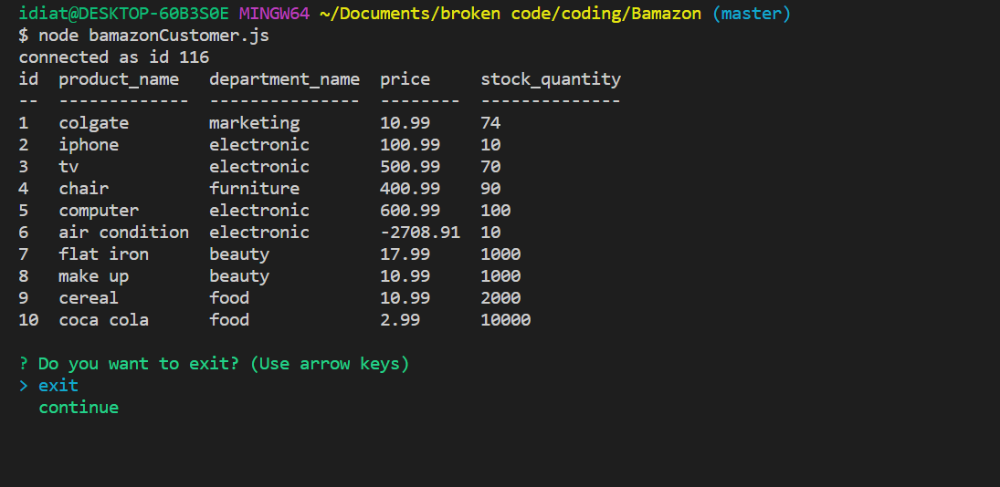
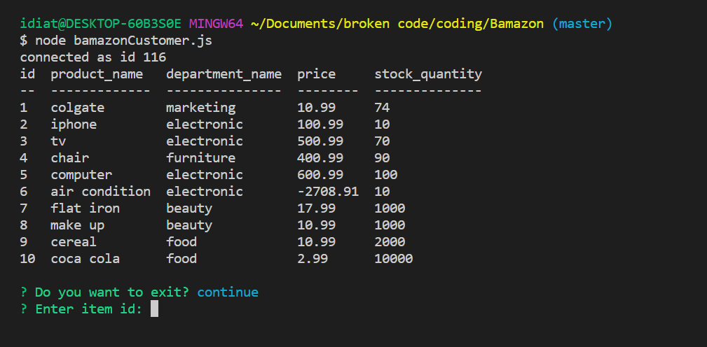
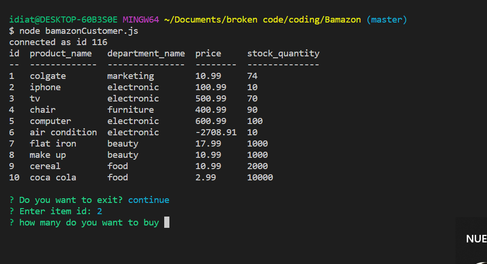
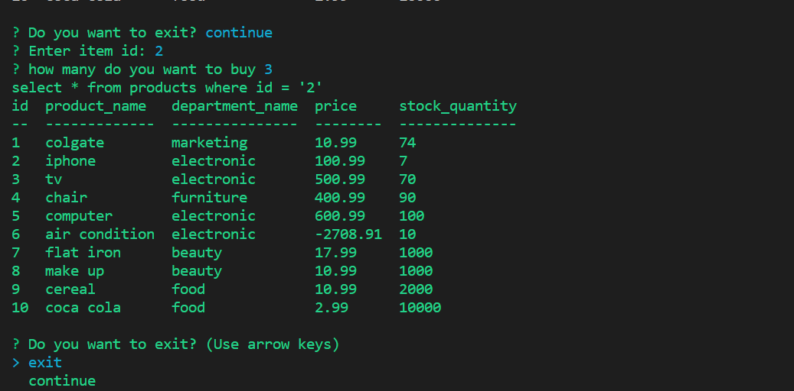
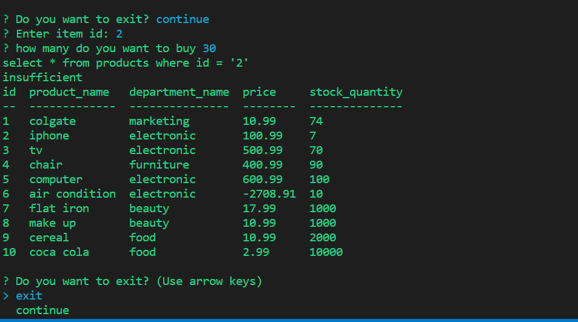

# Bamazon
Welcome to my Bamazon Application if you like it please check out my Github Profile to see my repositories.

Bamazon is a sellling application where you can place oders.
Bamazon will ask you first if you want to exit, or continue.
when you choose to continue it will display all the product that we have and it will ask you to put the product id, then it will ask how many do you want to buy? after putting the amount that you want then our stock will decrease. when your oder is higher than the stock it will pop up insufficient .

node bamazon it displays exit and continue

if you choose to continue:

then it will ask you the id number:

after how many product doo you want to buy:

if your amount is >the stock it display insuficient

The Bamazon application utilizes and requires these npm packages:

console.table

inquirer

myql

#Getting Started with the Bamazon command line application WARNING: If you are not familiar with the bash/terminal this app may not be suitible for you but feel free to try anyways.

Welcome user! So you want to use my command line node app? Okay! lets get started.

You are going to need to have Node.js Installed in order to run this javascript file in the terminal or command line.

Assuming you are familiar with node as well as the terminal/cli and are ready to move on continue to the next steps

You will need to go to my Github repository, you can then either fork the repository and copy the Clone with HTTPS link then run the following command with the link copied from your forked version of the repo to replace what comes after "git clone" from your terminal or bash window or clone my repository the same way using the link on my Github repo the command will look like this in the terminal/CLI:
Command:

git clone https://github.com/idiatou69/Bamazon

once on the app  you can star placing your oders.